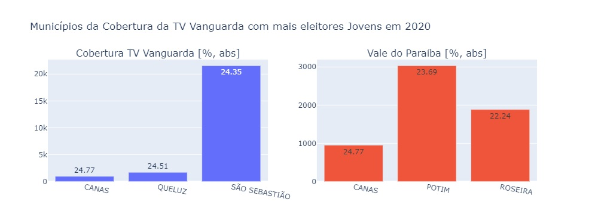
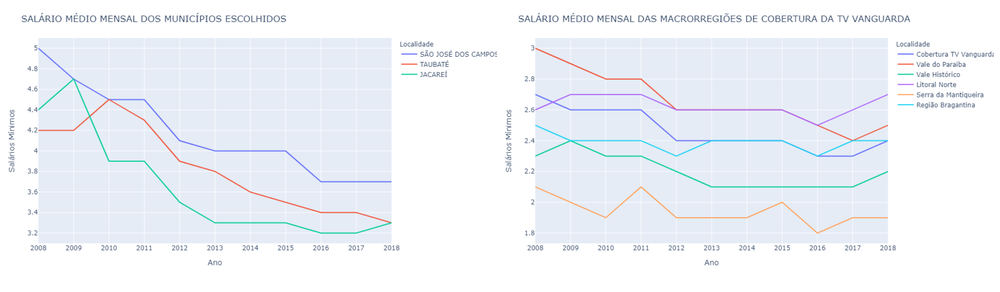
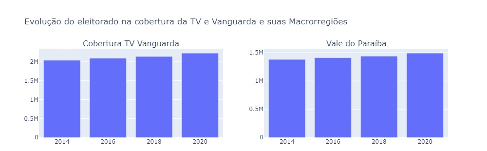
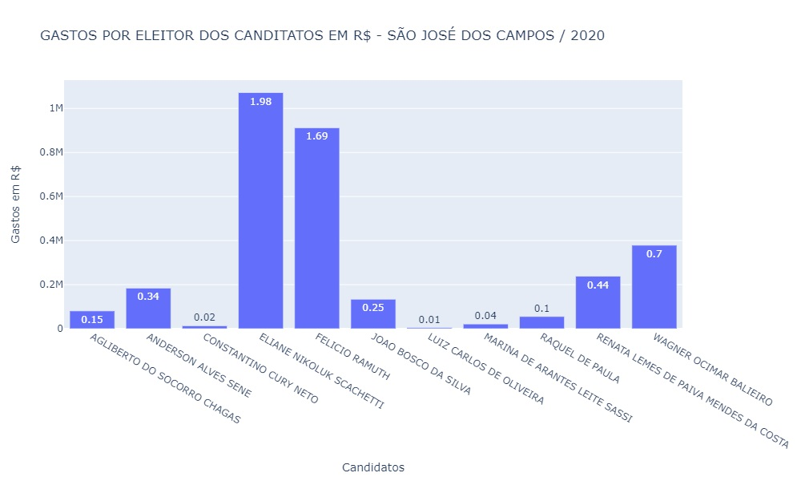
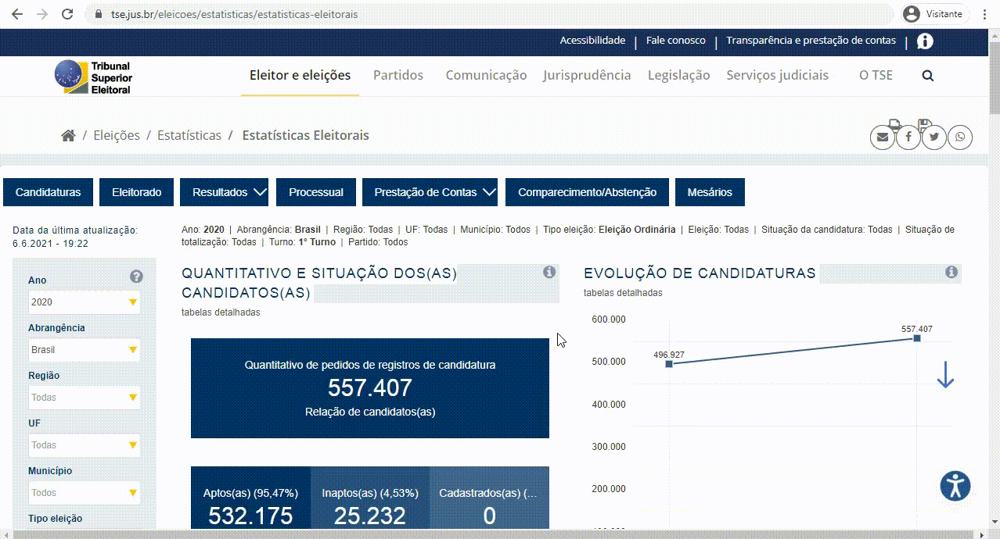
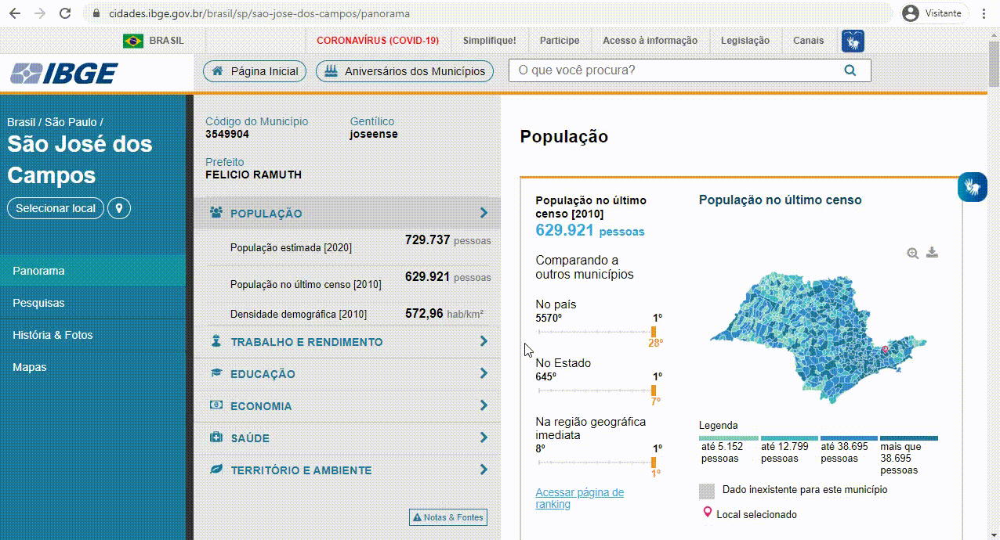

<br id="topo">

<h1 align="center"> Análise de Dados Eleitorais </h1>

<p align="center"> 
    <a href="#analise">Análises de interesse</a> &nbsp | &nbsp 
    <a href="#notebook">Manipulando o notebook</a> &nbsp | &nbsp 
    <a href="#dados">Os dados</a> &nbsp | &nbsp 
    <a href="#equipe">Responsáveis</a>
</p>
   
A análise de dados se faz importante para descobrir padrões ou relações entre certos aspectos para tirar conclusões, e como o objetivo deste projeto é, sobre tudo, exibir estatísticas sobre o eleitorado contido na cobertura da [TV Vanguarda](http://vanguarda.tv/), esta técnica foi utilizada para evidenciar características (como o estado civil, escolaridade e faixa etária), bem como informações sobre renda e evolução na quantidade de eleitores, além do candidato eleito em um determinado ano, resultando na geração de alguns gráficos interessantes...

<span id="analise">

## :bar_chart: Análises de interesse

A análise de dados foi feita através do Jupyter Notebook, onde focamos em atender os requisitos que o cliente declarou, com isso obtivemos alguns resultados interessantes quanto à renda dos eleitores e sua evolução em quantidade, além das cidades com as maiores percentagens de eleitores jovens e idosos em cada região e estatísticas também sobre o quanto foi gasto por eleitor por cada candidato em suas campanhas.

<br>

### Verificação das cidades com mais jovens na região

<div align="center">
  
</div>

<br>

### Verificação da renda média do eleitorado

<div align="center">
  
</div>

<br>

### Verificação da evolução na quantidade de eleitores

<div align="center">
  
</div>

<br>

### Valor que cada candidato gastou por eleitor em campanhas

<div align="center">
  
</div>

<br>

<span id="notebook">

## Manipulando o notebook

Para interagir com o Jupyter Notebook desenvolvido, tem-se 2 opções:

- Use [este link](https://nbviewer.jupyter.org/github/Equipe-01-DSM-2021/projeto-integrador-2021-1/blob/c0de58609ce020459126b7dee2df843f553fe933/jupyter-notebooks/AnaliseDadosEleitorais.ipynb) para ver as análises, mas sem poder alterar as variáveis (como cidade ou ano), pois o GitHub não suporta a visualização devido à biblioteca Python que usamos para gerar os gráficos;
- Depois de baixar este repositório e ter o [Python](https://www.python.org/downloads/) instalado, siga este passo a passo para abrir o Notebook localmente em seu dispositivo:

```powershell
# Acesse a pasta onde se localiza o notebook
cd jupyter-notebooks

# Instale o Jupyter Notebook
pip install jupyter

# Instale as bibliotecas necessárias
 pip install -r requirements.txt

# Inicie o servidor local
 jupyter notebook
```

→ [Voltar ao topo](#topo)

<span id="dados">

## :open_file_folder: Os dados

Foi utilizado como base de dados alguns CSVs públicos disponibilizados pelo TSE e IBGE, onde as fontes podem ser conferidas pelos links abaixo:

- [TSE - Tribunal Superior Eleitoral](https://www.tse.jus.br/eleicoes/estatisticas/repositorio-de-dados-eleitorais-1/repositorio-de-dados-eleitorais): Características do eleitorado e dos candidatos eleitos.
- [IBGE - Instituto Brasileiro de Geografia e Estatística](https://cidades.ibge.gov.br/brasil/sp/sao-jose-dos-campos/pesquisa/19/29765?localidade1=355410&localidade2=355030): Dados sobre renda da população

A partir destes links, para baixar os dados, siga os seguintes tutoriais:

### Bases de dados do TSE

Com este tutorial, é possível baixar os dados referentes aos candidatos, eleitorado e prestação de contas dos candidatos, onde este último não se encontra neste repositório devido ao seu tamanho que ultrapassa os limites que o GitHub suporta, logo, mesmo para uma primeira vez manipulando o notebook, é ideal baixar este CSV seguindo o passo a passo abaixo.

<div align="center">
  
</div>

<br>

### Bases de dados do TSE (Evolução dos eleitores)

Apesar dessas bases de dados ainda pertencerem ao TSE, estão em outro link, acessível [clicando aqui](http://www.tse.jus.br/eleicoes/estatisticas/estatisticas-eleitorais). Por conta disso, se fez necessário um tutorial específico para a captação destes CSVs.

<div align="center">
  
</div>

<br>

### Bases de dados do IBGE

Aplicamos a base de dados do IBGE na análise que diz respeito à renda dos eleitores, onde é preciso navegar por uma interface até que seja possível fazer o download dos dados, como o mostrado abaixo.

<div align="center">
  
</div>

<br>

→ [Voltar ao topo](#topo)

<span id="equipe">
	
## :busts_in_silhouette: Responsáveis
Nossa equipe é composta por 6 integrantes, onde todos colaboraram com o desenvolvimento do Jupyter Notebook, mas 3 tomaram a frente nestas tarefas e merecem destaque. São eles:

- Adriano Andrade Almeida
  - Responsável pela integração do notebook, viabilidade de algumas análises e desenvolvimento da análise sobre as cidades com mais eleitores jovens e idosos de cada região;
- Ana Carolina dos Santos
  - Responsável pela manipulação da biblioteca Plotly para geração de gráficos e desenvolvimento das análise sobre a renda do eleitorado e sobre a análise que diz respeito à prestação de contas dos candidatos;
- Caio Vitor Dias
  - Responsável pelo desenvolvimento da análise sobre a evolução na quantidade de eleitores e manipulação da biblioteca Plotly para geração de gráficos.

Outras pessoas deram suporte na geração de gráficos, manipulação de dados e ajustes no Markdown.

→ [Voltar ao topo](#topo)
