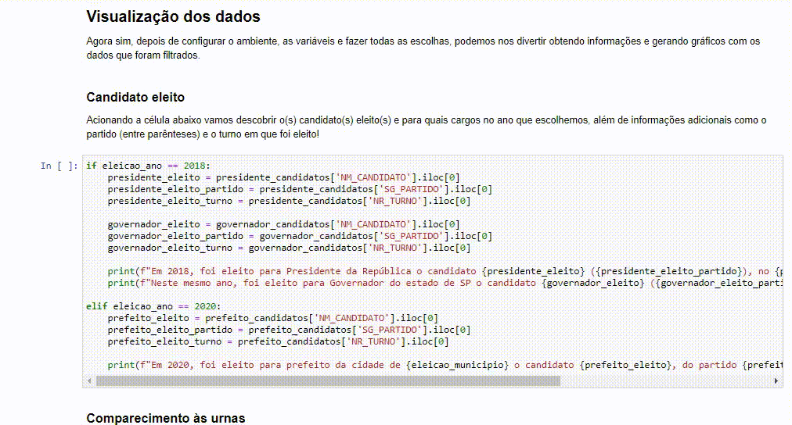
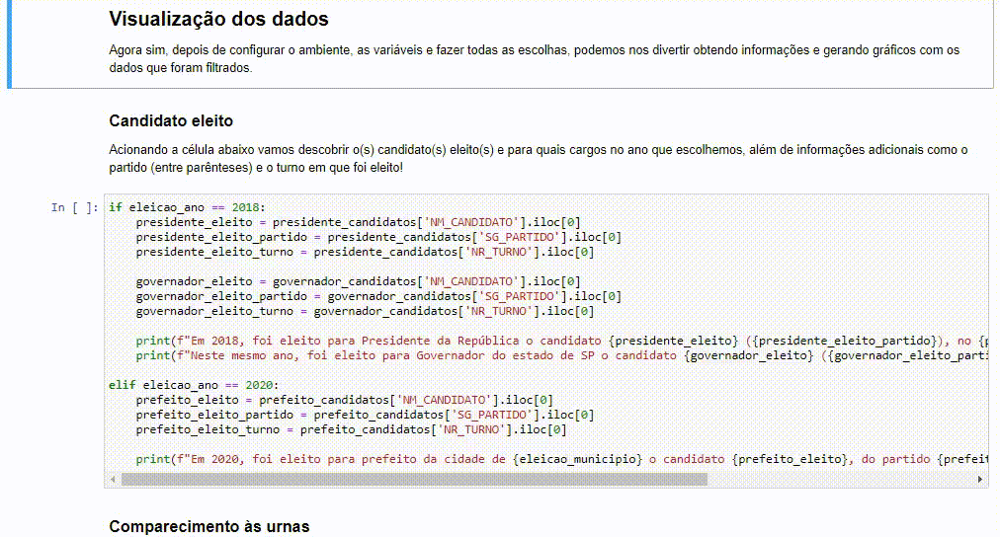
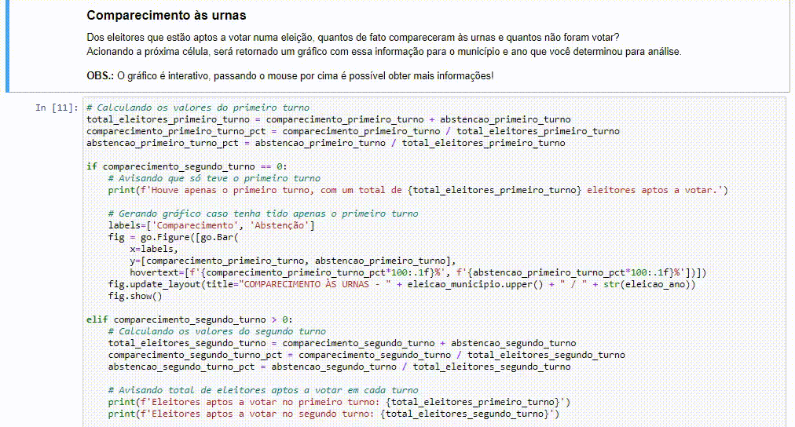
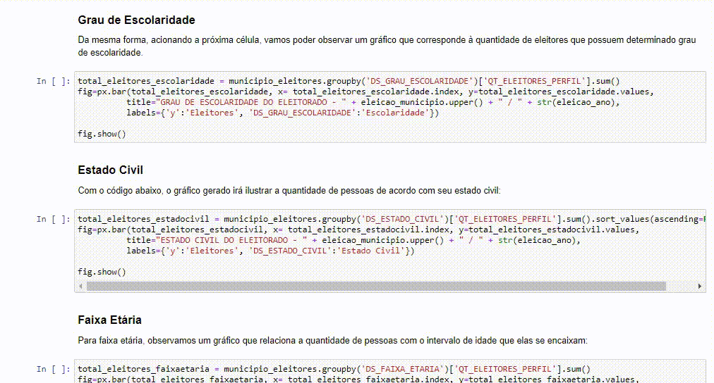
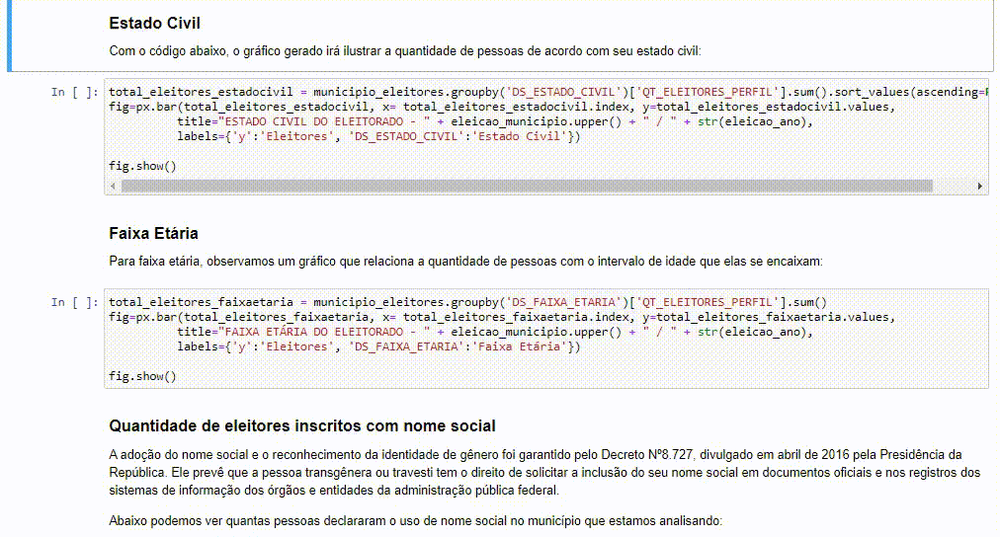
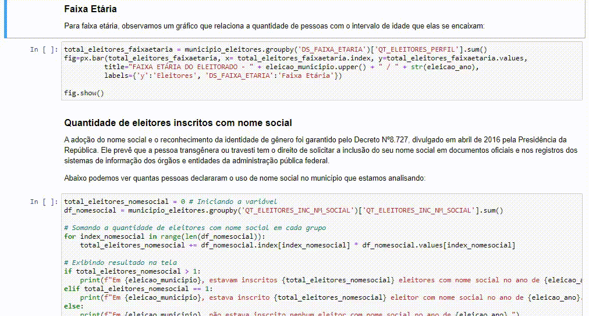
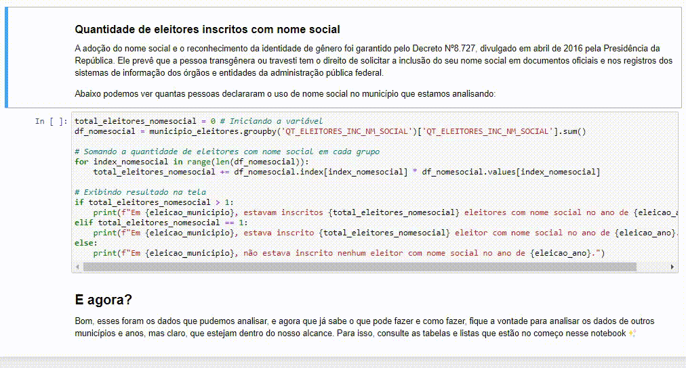
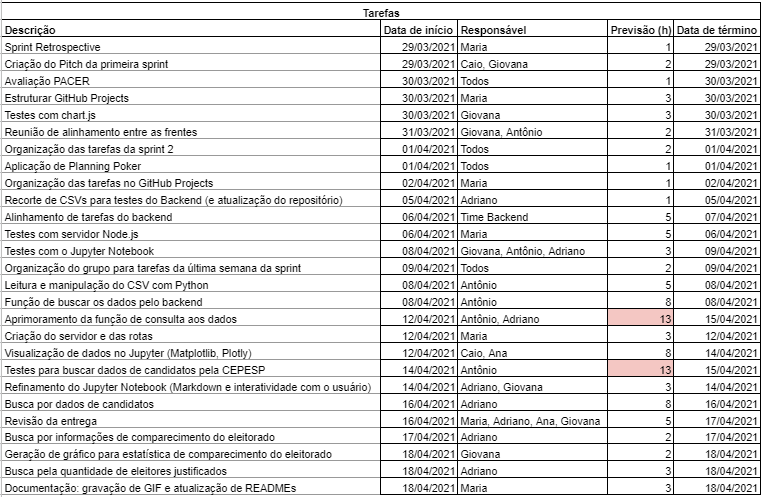

<br id="topo">

<h1 align="center"> Sprint 2: 29/03/2021 a 18/04/2021 </h1>

<p align="center"> 
    <a href="#objetivos">Objetivos da Sprint</a> | 
    <a href="#analise">Análise de Dados</a> | 
    <a href="#site">Site</a> | 
    <a href="#org-equipe">Organização da Equipe</a> | 
    <a href="#org-repo">Organização do Repositório</a> | 
    <a href="#tag">Tag: sprint-02</a>
</p>
   
No decorrer da segunda sprint, realizamos as tarefas de maior prioridade apontadas pelo cliente, as quais tinham foco no back-end e análise de dados, como a manipulação de CSVs e aplicação de consultas com determinados filtros, bem como a visualização dos resultados por meio de gráficos e tabelas. 

<span id="objetivos">

# :dart: Objetivos da Sprint
Seguindo o planejamento das sprints, para a 2ª rodada teríamos de satisfazer essencialmente 3 itens do backlog do produto:
  - RF 01: Geração de estatísticas sobre eleitorado
  - RF 02: Verificação características do eleitorado de acordo com o representante eleito
  - RF 07: Geração de estatísticas sobre comparecimento e ausência da última eleição

No entanto, até a metade da sprint houveram complicações e atrasos com relação a definição desses requisitos e do modo como a entrega deveria ser feita. Apesar desses impedimentos momentâneos, o escopo do projeto não se alterou, apenas o backlog das sprints e User Stories, ocasionando mudanças  nas tarefas dos itens da sprint (o "passo a passo" para tornar realidade cada requisito do projeto).

- :pushpin: Para verificar os backlogs das sprints e do produto, [clique aqui](https://github.com/Equipe-01-DSM-2021/projeto-integrador-2021-1#backlogs).

→ [Voltar ao topo](#topo)

<span id="analise">

# Análise de Dados
A prioridade do cliente para com a entrega da segunda sprint se mostrou por meio de tarefas classificadas como de "back-end", a análise de dados em si. Para aplicar filtros, consultas e manipular os CSVs disponíveis, foi utilizado o [Jupyter Notebook](https://jupyter.org/), uma aplicação web gratuita que gera um ambiente onde é possível juntar textos explicativos em Markdown com linhas de códigos que podem ser facilmente compiladas lá mesmo.

## Demonstração de consultas no Jupyter Notebook
É possível realizar a entrada de certas variáveis para receber o resultado da busca, obtendo a visualização dos dados por meio da organização deles em gráficos utilizando uma biblioteca do Python chamada [Plotly](https://plotly.com/python/). <br>
Abaixo pode-se observar uma série de exeplos de visualização gerados pela análise de dados, onde o municípo utilizado para gerar esses resultados foi "São José dos Campos", no ano de 2018 para as eleições estadual e federal, e 2020 para eleição municipal.
- Para todas as análises há um título e um breve texto antes da célula de código para explicar o que será gerado, e assim que a célula é acionada, a visualização aparece logo abaixo.

####  Candidato eleito (2018 - Presidente e Governador)
<div align="center">
  
</div>

####  Candidato eleito (2020 - Prefeito)
<div align="center">
  
</div>

#### Comparecimento às urnas
<div align="center">
  
</div>

#### Grau de escolaridade
<div align="center">
  
</div>

#### Estado civil
<div align="center">
  
</div>

#### Faixa etária
<div align="center">
  
</div>

#### Uso de nome social
<div align="center">
  
</div>

## Demonstração completa
Clique no link abaixo para visualizar o Jupyter Notebook completo, com a aplicação dos anos de 2018 e 2020 nas análises:
> [Análise de dados completa](...)

## 🎲 Rodando o Jupyter Notebook
Antes de utilizar nosso notebook pela primeira vez, é preciso instalar as bibliotecas Python necessárias, incluindo a instalação do Jupyter Notebook. Para isso, depois de baixar esse repositório, basta abrir a pasta "jupyter-notebooks" no terminal, localizada na raíz desse projeto, e executar os comandos abaixo. Depois é só aguardar o download e a instalação concluírem.
- OBS.: Lembrando que antes de tudo deve-se ter o Python já instalado (faça o download [aqui](https://www.python.org/downloads/))

```powershell 
# Instale o Jupyter Notebook
pip install jupyter

# Instale as bibliotecas necessárias
pip install -r requirements.txt
```
Agora, para que o notebook seja manipulado localmente, execute o seguinte comando:

```powershell 
jupyter notebook
```

<div align="center">
  
</div>

→ [Voltar ao topo](#topo)


<span id="site">

# Site
Ainda que a prioridade do cliente para a segunda entrega parcial seja majoritariamente tarefas de análise de dados, houveram trabalhos em paralelo para continuar o desenvolvimento do site. Esses trabalhos envolveram estudo, testes e aplicação de conceitos de [JavaScript](https://developer.mozilla.org/pt-BR/docs/Web/JavaScript), assim como sua aplicação no servidor utilizando o Node.js. Abaixo é posível conferir os primeiros passos da instituição do servidor no projeto.

## Demonstração do servidor ativo
<div align="center">
  
</div>

OBS.: Para reproduzir os mesmos resultados, baixe o [Node.js](https://nodejs.org/en/) e siga os seguintes passos:

### 🎲 Rodando o Back-end (servidor)
Faça o download deste repositório, ou, caso possuia o [Git](https://git-scm.com/), você pode clonar o repositório com o seguinte comando:

```bash 
$ git clone https://github.com/Equipe-01-DSM-2021/projeto-integrador-2021-1.git
```
Depois de clonar o repositório (ou baixá-lo):

```bash
# Acesse a pasta do projeto no terminal/cmd
$ cd projeto-integrador-2021-1/projeto

# Vá para a pasta src
$ cd src

# Instale as dependências
$ npm install

# Execute a aplicação
$ npm run dev

# O servidor inciará na porta:3000 - acesse http://localhost:3000
```
→ [Voltar ao topo](#topo)


<span id="org-equipe">
	
## :busts_in_silhouette: Organização da Equipe
Houve a permanência da divisão entre os times Front-end e Back-end, mas dois integrantes passaram temporariamente a pertencer ao time Back-end por conta da quantidade de tarefas relacionadas a essa frente. A partir disso, foram delimitadas as tarefas de cada integrante do grupo, onde o time Back-end se focou na análise e visualização dos dados enquanto duas pessoas permaneceram no Front-end, pesquisando e testando lógicas e arquivos para serem futuramente implementados.
  - Observe abaixo o gráfico Burndown gerado pela equipe nesta segunda sprint, onde o eixo X equivale aos dias trabalhados na sprint e os valores do eixo Y representam as entregas e esforços realizados com o passar do tempo. 
    - OBS.: Dias marcados em cinza foram considerados dias de trabalho opcionais, como finais de semana e feriados.

<div align="center">
    
    
</div>

→ [Voltar ao topo](#topo)

<span id="org-repo">

## :file_folder: Organização do Repositório
Como sendo uma aplicação web, foi decidido utilizar a arquitetura [MVC](https://developer.mozilla.org/en-US/docs/Glossary/MVC) como modelo de organização das pastas do repositório, auxiliando também na definição da responsabilidade de cada arquivo e função. 
- Como o descrito no site oficial do Mozilla para desenvolvimento de padrões web, podemos definir as partes do MVC como:

  > **Model/Modelo:** gerencia dados e lógica de negócios; <br>
  > **View/Visualização:** controla o layout e a exibição; <br>
  > **Controller/Controlador:** encaminha comandos para o model e/ou view em resposta à entrada dos usuários da aplicação.

→ [Voltar ao topo](#topo)

<span id="tag">

## :label: Tag: sprint-02
Para marcar a entrega feita na segunda sprint, foi criada uma tag neste repositório com o nome "sprint-02", que corresponde ao estado em que se encontra o projeto do dia da entrega, ou seja, dia 18/04/2021. Com a tag, sempre será possível visualizar como estava o repositório ao fim da segunda sprint, por mais que o projeto sofra alterações, pois tags em si não são mutáveis conforme o tempo, sendo a maneira escolhida pelo time para sinalizar as entregas até o fim do projeto.

→ [Voltar ao topo](#topo)
