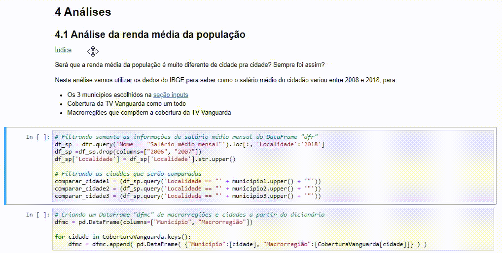
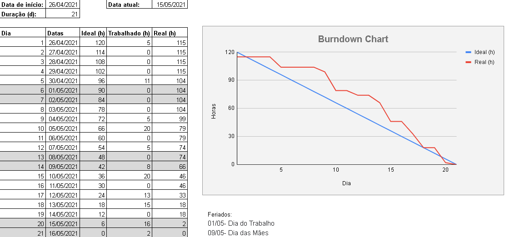
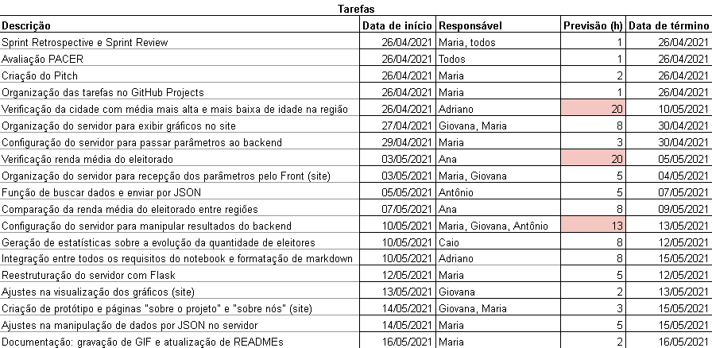

<br id="topo">

<h1 align="center"> Sprint 3: 26/04/2021 a 16/05/2021 </h1>

<p align="center"> 
    <a href="#objetivos">Objetivos da Sprint</a> | 
    <a href="#analise">Análise de Dados</a> | 
    <a href="#site">Site</a> | 
    <a href="#org-equipe">Organização da Equipe</a> | 
    <a href="#tag">Tag: sprint-03</a>
</p>
   
No decorrer desta sprint, continuamos seguindo o planejamento, finalizando as tarefas mais preciosas para o cliente no momento. Tais tarefas tinham foco na análise de dados, mas também em relação a construção do site, com seu front-end e back-end, além da integração entre essas frentes.

<span id="objetivos">

# :dart: Objetivos da Sprint

Para a 3ª sprint, o combinado entre o time e o cliente foi a entrega destes itens do backlog do produto:

- RF 03: Verificação das cidades com mais jovens e mais idosos na região
- RF 05: Verificação da renda média do eleitorado
- RF 06: Comparação renda média do Vale do Paraíba com outras regiões
- RF 08: Verificação da evolução na quantidade de eleitores

:pushpin: Para verificar os backlogs de outras sprints e do produto, [clique aqui](https://github.com/Equipe-01-DSM-2021/projeto-integrador-2021-1#backlogs).

→ [Voltar ao topo](#topo)

<span id="analise">

# :mag: Análise de Dados

Apontada como prioridade para o cliente, continuamos a desenvolver as tarefas que continham em sua base a análise de dados com o Jupyter Notebook, onde focamos em atender os requisitos quanto à renda dos eleitores (utilizando dados do IBGE) mas também alguns outros pedidos, como descobrir a evolução da quantidade de eleitores em cada cidade conforme os anos e as cidades com as maiores percentagens de eleitores jovens e idosos.

## Demonstração de consultas no Jupyter Notebook

Seguindo o molde desenvolvido na 2ª sprint, de permitir a alteração das variáveis para então realizar as buscas e a visualização dos dados, é possível observar, nas demonstrações abaixo, alguns exemplos de como foram desenvolvidos os requisitos, onde o município principal utilizado para gerar esses resultados foi "São José dos Campos", no ano de 2020, pertencente à região do "Vale do Paraíba", além de cidades como "Taubaté" e "Jacareí" usadas para algumas comparações.

## Verificação das cidades com mais jovens e mais idosos na região

Nesta análise é possível obter as cidades com mais eleitores jovens e idosos dentro da cobertura da Vanguarda, além de separar também por cada macro-região.

<div align="center">
  
</div>

## Verificação da renda média do eleitorado

Nesta análise é possível observar a variação da renda média do eleitorado de São José dos Campos, mas também em comparação à outras cidades ao longo dos anos.

<div align="center">
  
</div>

## Comparação renda média do Vale do Paraíba com outras regiões

Nesta análise pode-se observar uma comparação entre a renda média de todas as regiões.

<div align="center">
  
</div>

## Verificação da evolução na quantidade de eleitores

Já nesta análise, além da evolução da quantia de eleitores em São José dos Campos, tem-se também a análise das macro-regiões.

<div align="center">
  
</div>

Para interagir com o Jupyter Notebook desenvolvido, tem-se 2 opções:

- Use [este link](https://nbviewer.jupyter.org/github/Equipe-01-DSM-2021/projeto-integrador-2021-1/blob/a44edcce3a86c0f1c070d5b6c52d683010af94cd/jupyter-notebooks/AnaliseDadosEleitorais.ipynb) para ver as análises, mas sem poder alterar as variáveis (como cidade ou ano), pois pelo GitHub não é possível ter essa visualização devido à biblioteca Python que usamos para gerar os gráficos (ela não é suportada pelo visualizador do GitHub).
- Baixe este repositório e siga o passo a passo descrito no tópico "Rodando o Jupyter Notebook" [deste link](https://github.com/Equipe-01-DSM-2021/projeto-integrador-2021-1/blob/trunk/planejamento/sprint-2/README.md#analise) para abrir o Notebook localmente em seu dispositivo.

→ [Voltar ao topo](#topo)

<span id="site">

# :desktop_computer: Site

Mesmo que a prioridade do cliente esteja na análise de dados, a confecção do site se fez também importante, então houveram trabalhos em paralelo para continuar o desenvolvimento do site, envolvendo estudos e testes para a integração entre front-end e back-end (formação de API). Com o servidor criado na sprint anterior, em Node, nos encontramos diante de muitos problemas, e mediante a isso, resolvemos reestruturar todo o site baseando o servidor em Flask, assim dando seguimento a criação de rotas e funções para a comunicação entre o front-end e back-end por meio da passagem de parâmetros e respostas em JSON. Houve também mudanças na interação e visual do site, como a construção de outras páginas ("sobre o projeto" e "sobre nós") e o registro de todas as cidades de São Paulo, dentro da cobertura da Vanguarda, deixando os campos de busca mais robustos.

## Demonstração

Foi desenvolvido um novo layout para a aplicação completa, que é capaz de integrar o front-end com o back-end, porém ainda possui inconvenientes quanto ao tipo dos dados que transitam entre as frentes. Por conta disso, não é possível exibir as estatísticas do eleitorado em cards, ainda assim, é possível interagir com o site, escolhendo a cidade e retornando a análise de dados para um terminal, por exemplo, utilizando os dados recebidos pelo back-end. Observe um exemplo com a cidade "Aparecida", no ano de "2020", que retorna estatísticas quanto à faixa etária do eleitorado:

<div align="center">
  
</div>

## Rodando o Back-end (servidor em Flask)

Faça o download deste repositório, ou, caso possua o [Git](https://git-scm.com/), você pode clonar o repositório com o seguinte comando:

```bash
 git clone https://github.com/Equipe-01-DSM-2021/projeto-integrador-2021-1.git
```

Depois de clonar o repositório (ou baixá-lo), e baixar o [Python](https://www.python.org/downloads/):

```powershell
# Acesse a pasta do projeto no terminal/cmd
 cd projeto-integrador-2021-1/projeto

# Instale as dependências
 pip install -r requirements.txt

# Execute a aplicação
 python app.py

# O servidor inciará na porta 5000 - acesse http://localhost:5000/
```

→ [Voltar ao topo](#topo)

<span id="org-equipe">
	
# :busts_in_silhouette: Organização da Equipe
Ainda com a divisão entre os times Front-end e Back-end, com a concentração do time na análise de dados (back-end), foi definido as tarefas chave para a realização da entrega desta sprint, com a instauração do site e mais análises com o Jupyter Notebook.
  - Observe abaixo o gráfico de Burndown gerado pela equipe nesta sprint, onde o eixo X equivale aos dias trabalhados e os valores do eixo Y representam as entregas e esforços realizados com o passar do tempo. 
    - OBS.: Os dias destacados foram considerados dias de trabalho opcionais, como finais de semana e feriados.

<div align="center">
    
    
</div>

→ [Voltar ao topo](#topo)

<span id="tag">

# :label: Tag: sprint-03

Para marcar a entrega desta sprint, foi criada uma tag neste repositório com o nome "sprint-03", correspondente ao estado em que se encontra o projeto no dia da entrega, ou seja, dia 16/05/2021. Com a tag, sempre será possível visualizar como estava o repositório ao fim da terceira sprint, já que, por mais que o projeto sofra alterações, as tags são imutáveis, sendo a maneira escolhida pelo time para sinalizar as entregas até o fim do projeto.

→ [Voltar ao topo](#topo)
