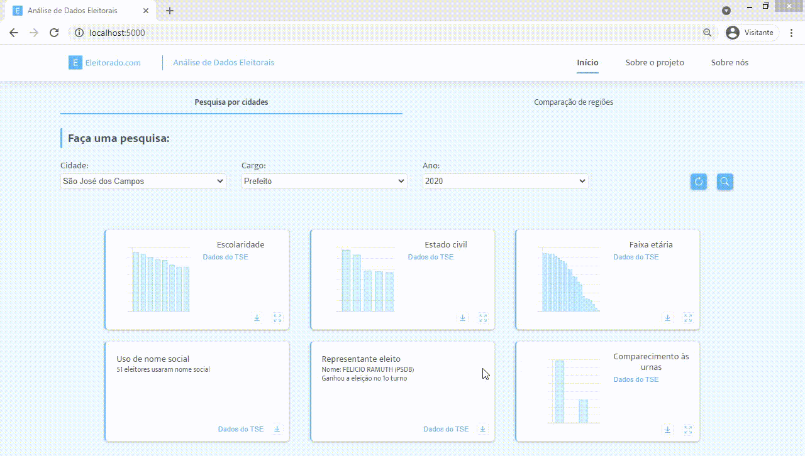
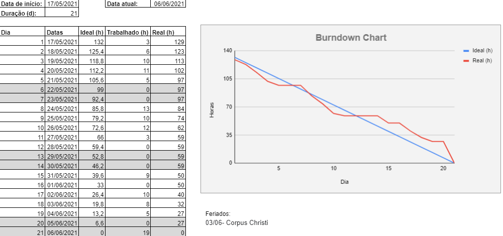
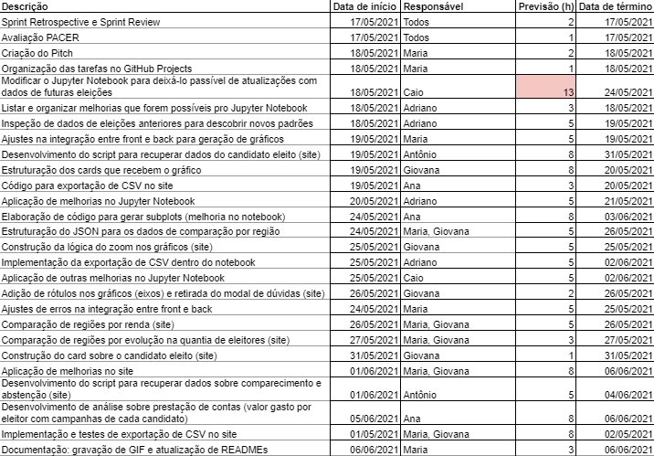

<br id="topo">

<h1 align="center"> Sprint 4: 17/05/2021 a 06/06/2021 </h1>

<p align="center"> 
    <a href="#objetivos">Objetivos da Sprint</a> &nbsp|&nbsp  
    <a href="#notebook">Jupyter Notebook</a> &nbsp|&nbsp  
    <a href="#site">Site</a> &nbsp|&nbsp  
    <a href="#org-equipe">Organização da Equipe</a> &nbsp|&nbsp  
    <a href="#tag">Tag: sprint-04</a>
</p>
   
Sendo a última sprint do projeto, o foco foi concluir todos os requisitos do produto e aplicar melhorias ao que já havia sido desenvolvido, tendo como base as sugestões e feedbacks do cliente.

<span id="objetivos">

# :dart: Objetivos da Sprint

Para a 4ª sprint, a entrega combinada era o requisito de número 04: "Exportação dos resultados da busca", último item do backlog do produto a ser desenvolvido, além da aplicação de melhorias no notebook e no site. Para verificar os backlogs de outras sprints e do produto, [clique aqui](https://github.com/Equipe-01-DSM-2021/projeto-integrador-2021-1#backlogs).

### :mag: Análise de Dados

Definida como prioridade para o cliente desde o início do projeto, a análise de dados foi feita inicialmente utilizando o Jupyter Notebook, onde, a cada sprint, era incrementado com mais análises. No entanto, nesta reta final, o objetivo era aprimorar os códigos e visualização dos dados, aplicando também a possibilidade de exportação dos dados em CSVs, além de, claro, concluir o site: outra ferramenta para a visualização das estatísticas.

<span id="notebook">

# :bar_chart: Jupyter Notebook

O notebook desenvolvido desde a 2ª sprint contém todas as análises referentes aos requisitos levantados na 1ª sprint, além de adições conforme a construção do projeto. Tal aplicação permite manipular as bases de dados e extrair diversas análises em gráficos e tabelas, sendo elas:

- Classificação do eleitorado a partir do estado civil, escolaridade e faixa etária, além da quantidade de eleitores que utilizam nome social por eleição
- Possibilidade de relacionar as características do eleitorado de acordo com o representante eleito naquele ano (tanto presidente, quanto governador ou prefeito)
- Estatísticas sobre a renda média do eleitorado de determinada região
- Relação das cidades com mais eleitores jovens e mais eleitores idosos em cada região
- Percentagem de eleitores presentes e ausentes da última eleição
- Estatísticas sobre a evolução do número de eleitores em cada região
- Análise dos gastos de cada candidato por eleitor em suas campanhas

O notebook também permite o controle sobre algumas variáveis dentro do ambiente, como o ano em que a eleição ocorreu e a cidade principal da análise (com mais duas cidades para comparações, em alguns casos). Sendo muitas as possibilidades, baseadas em todas as cidades existentes dentro da cobertura da TV Vanguarda e alguns anos eleitorais disponibilizados pelo TSE, o notebook tomou uma forma extensa e completa, centralizando tudo em um só lugar, o que trás diversas facilidades desde a reutilização de variáveis e códigos até uma melhor localização do próprio usuário em meio aos resultados obtidos. Na demonstração abaixo é possível observar todas as estatísticas resultantes do esforço do time durante todo o projeto, satisfazendo todas as requisições do cliente.

<div align="center">
  
</div>

Para visualizar o notebook completo, use [este link](https://nbviewer.jupyter.org/github/Equipe-01-DSM-2021/projeto-integrador-2021-1/blob/c0de58609ce020459126b7dee2df843f553fe933/jupyter-notebooks/AnaliseDadosEleitorais.ipynb), que infelizmente não permite a alteração de variáveis (como cidade ou ano), ou siga o passo a passo descrito no tópico abaixo para rodar a aplicação localmente, que promove total manipulação das variáveis.

### Rodando localmente o notebook

Faça o download deste repositório, ou, caso possua o [Git](https://git-scm.com/), você pode clonar o repositório com o seguinte comando:

```bash
 git clone https://github.com/Equipe-01-DSM-2021/projeto-integrador-2021-1.git
```

Depois de clonar o repositório (ou baixá-lo), e baixar o [Python](https://www.python.org/downloads/):

```powershell
# Acesse a pasta do notebook pelo no terminal
 cd jupyter-notebooks

# Instale o Jupyter Notebook
 pip install jupyter

# Instale as dependências
 pip install -r requirements.txt

# Execute a aplicação
 jupyter notebook

# O notebook será aberto localmente, pelo navegador
```

→ [Voltar ao topo](#topo)

<span id="site">

# :desktop_computer: Site

A prioridade do cliente sempre foi a análise de dados, mais especificamente um site para evidenciar as estatísticas e resultados obtidos com a manipulação das bases de dados, ainda que houvesse o pedido especial de desenvolver um notebook com a ferramenta Jupyter Notebook com as mesmas análises. Dado os fatos, a construção do notebook e do site foram feitas paralelamente, envolvendo estudos e testes para a integração entre o front-end e back-end, atendendo aos requisitos e desenvolvendo uma interface amigável e intuitiva.

A demonstração abaixo mostra a versão final do projeto, que é capaz de exibir as estatísticas do eleitorado, organizando-as em "cards", fazendo uma busca por uma cidade e um ano e retornando a análise. Com a existência de requisitos que pediam por comparação entre regiões, também foi criada uma sessão apenas para tais comparações.

<div align="center">
  
</div>

Também é possível exportar os dados de cada análise via CSV no site, como o exemplo abaixo:

<div align="center">
  
</div>

### Rodando localmente a aplicação

Faça o download deste repositório, ou, caso possua o [Git](https://git-scm.com/), você pode clonar o repositório com o seguinte comando:

```bash
 git clone https://github.com/Equipe-01-DSM-2021/projeto-integrador-2021-1.git
```

Depois de clonar o repositório (ou baixá-lo), e baixar o [Python](https://www.python.org/downloads/):

```powershell
# Acesse a pasta do projeto por um terminal
 cd projeto

# Instale as dependências
 pip install -r requirements.txt

# Execute a aplicação
 python app.py

# O servidor inciará na porta 5000 - acesse http://localhost:5000/
```

→ [Voltar ao topo](#topo)

<span id="org-equipe">
	
# :busts_in_silhouette: Organização da Equipe
Durante todo o projeto, o grupo se adequou quanto as demandas de tarefas e suas áreas, se dividindo entre times Front-end e Back-end, cada qual responsável por atividades chaves para a realização da entrega de cada sprint. O gráfico de Burndown abaixo foi gerado pela equipe nesta sprint, onde o eixo X equivale aos dias trabalhados e os valores do eixo Y representam as entregas e esforços realizados com o passar do tempo. 
    - OBS.: Os dias destacados foram considerados dias de trabalho opcionais, como finais de semana e feriados.

<div align="center">
    
    
</div>

→ [Voltar ao topo](#topo)

<span id="tag">

# :label: Tag: sprint-04

Para marcar a entrega desta sprint, foi criada uma tag neste repositório com o nome "sprint-04", correspondente ao estado em que se encontra o projeto no dia da entrega, ou seja, dia 06/06/2021. Com a tag, sempre será possível visualizar como estava o repositório ao fim da quarta sprint, já que, por mais que o projeto sofra alterações, as tags são imutáveis, sendo a maneira escolhida pelo time para sinalizar as entregas até o fim do projeto.

→ [Voltar ao topo](#topo)
